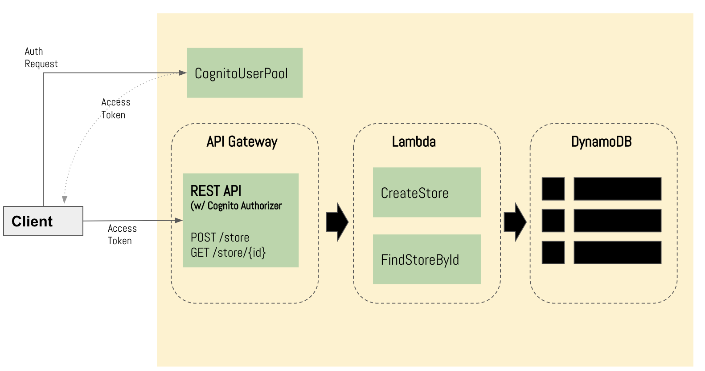

# README.md

This project demonstrates a sample serverless application using AWS API Gateway, Lambda and DynamoDB.  
It also uses AWS cognito to secure the API endpoint by having an authenticated call.  Following is the application diagram:  

AWS Resources are defined using cloudformation template file which requires the following parameters:
1.  JarS3BucketParam - S3 bucket where cloudformation will pickup the jar file (AWS lambda functions)
2.  JarFilenameParam - AWS Lambda function package filename.
3.  ApiStageNameParam - API Stage name where the API endpoints will be deployed.
4.  UserPoolArnParam - ARN of the Cognito User Pool.  (soon this will included in the cloudformation file.
)
## Application Build and Deployment.

1. Build package  

    `$ get clone <GIT-URL>`
    
    `$ mvn clean package`

2. Create S3 Bucket and copy `jambolan-cloudformation.yaml` and t`arget/jambolanapi-LATEST.jar` into an S3 Bucket.

3. Create a user pool and take note of the ARN  

4.  Create the Stack using cloudformation (jambolan-cloudformation.yaml) 

    `$ aws cloudformation create-stack --stack-name <STACK-NAME> --template-url <S3-URL> --parameters \ `
    `ParameterKey=JarS3BucketParam,ParameterValue=<BUCKET-NAME-FOR-JARFILE> \ `
    `ParameterKey=JarFilenameParam,ParameterValue=<JAR-FILENAME> \ `
    `ParameterKey=ApiStageNameParam,ParameterValue=<API-STAGE-NAME> \ `
    `ParameterKey=UserPoolArnParam,ParameterValue=<USERPOOL-ARN>`

# Invoking the API

1.  Sign a user in to the user pool, and obtain the access token. 
2.  Call the deployed API and supply the appropriate token in the Authorization header.

See https://docs.aws.amazon.com/apigateway/latest/developerguide/how-to-call-api.html for more info.