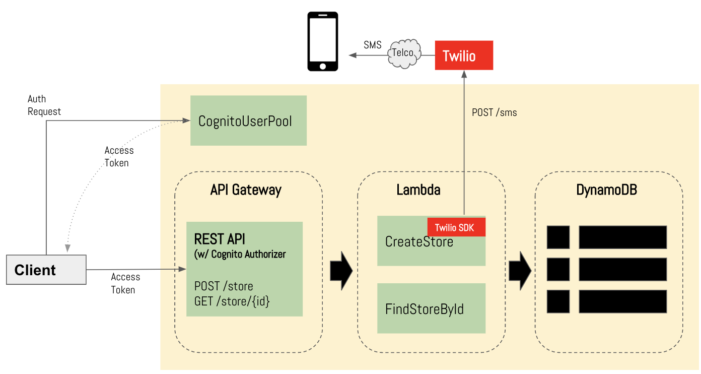

# README.md

This project demonstrates a sample serverless application using:

1. AWS Cognito
2. AWS API Gateway
3. AWS Lambda
4. AWS DynamoDB
5. Twilio SMS API
6. AWS CloudFormation 

Following is the application diagram:  



Transaction Flow:

1. Client authenticates using **OAUTH Authorization Code Grant** flow 
2. Client sends **POST /stores** or **GET /stores/{id}** request to API Gateway endpoint passing the access token in Authrorization header. \
  **Note:** CloudFormation outputs the **rool URL** for API Gateway endpoints after successful deployment.  See **Outputs:** section of jambolan-cloudformation.yaml.
3. API Gateway validates the token and calls the approriate lambda funtion.  

### CloudFormation Template

AWS Resources are defined using cloudformation template which needs the following parameters to ne deployed:
1.  JarS3BucketParam - S3 bucket where cloudformation will pickup the jar file (AWS lambda functions)
2.  JarFilenameParam - AWS Lambda function package filename.
3.  ApiStageNameParam - API Stage name where the API endpoints will be deployed.
4.  UserPoolArnParam - ARN of the Cognito User Pool.  
5.  TwilioAccountSIdParam - Account SID provided when you sign up
6.  TwilioAuthTokenParam - Auth Token provided when you sign up
7.  TwilioMessageServiceIdParam - Message Service Id

The template uses TwilioAccountSIdParam, TwilioAuthTokenParam and wilioMessageServiceIdParam to create environment variables (TWILIO_ACCOUNT_SID, TWILIO_AUTH_TOKEN, TWILIO_MESSAGING_SERVICE_ID) needed by CreateStore lambda function. 

### Application Build and Deployment.

1.  Clone this repository and run  
    
        $ mvn clean package

    This command will compile, unit test and package the lambda application into a jar file.  The unit test makes use of an embedded DynamoDB.

2.  Create S3 Bucket and copy **jambolan-cloudformation.yaml** and **target/jambolanapi-LATEST.jar** into the S3 Bucket.  Take note of the Bucket Name and S3 URL of **jambolan-cloudformation.yaml**.

3.  Signup for a Twilio account and take note of **Accound Sid** and **Auth Token**.

4.  Create a Message Service in Twilio and take note of the **Message Service Id**.  You also need to get a Twilio Phone Number (available for free using Twilio Trial Account) and associate it with the Message Service.

5.  Create a user pool and take note of the ARN and Authorization Scope.  For each **AWS::ApiGateway::Method** resource in jambolan-cloudformation.yaml,  Put the defined authorization scopes like so:
    ```
    AuthorizationScopes:
     - https://5kaiekf3pl.execute-api.us-west-1.amazonaw.com/dev-stage/stores/stores.read
     - https://5kaiekf3pl.execute-api.us-west-1.amazonaws.com/dev-stage/stores/stores.write
     ```
        
6.  Create the Stack using cloudformation (jambolan-cloudformation.yaml) 
    ```
    $ aws cloudformation create-stack --stack-name <STACK-NAME> --template-url <S3-URL> --parameters \
    ParameterKey=JarS3BucketParam,ParameterValue=<BUCKET-NAME-FOR-JARFILE> \
    ParameterKey=JarFilenameParam,ParameterValue=<JAR-FILENAME> \
    ParameterKey=ApiStageNameParam,ParameterValue=<API-STAGE-NAME> \
    ParameterKey=UserPoolArnParam,ParameterValue=<USERPOOL-ARN> \
    ParameterKey=TwilioAccountSIdParam,ParameterValue=<USERPOOL-ARN> \
    ParameterKey=TwilioAuthTokenParam,ParameterValue=<USERPOOL-ARN> \
    ParameterKey=TwilioMessageServiceIdParam,ParameterValue=<USERPOOL-ARN>
    ```
# Invoking the API

1.  Sign a user in to the user pool, and obtain the access token. 
2.  Call the deployed API and supply the appropriate token in the Authorization header.

See https://docs.aws.amazon.com/apigateway/latest/developerguide/how-to-call-api.html for more info.